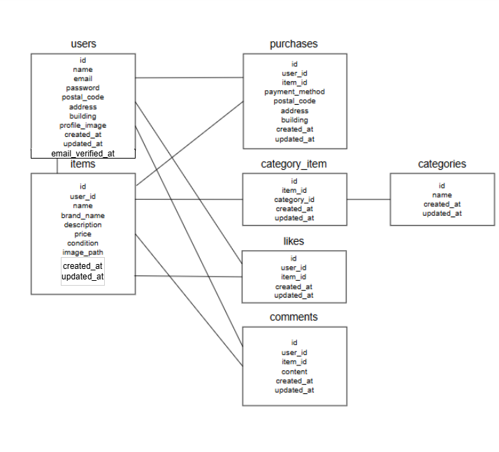

# フリマアプリ（COACHTECH 模擬案件）

## 概要

Laravelを用いて作成したフリマアプリです。
ユーザー登録、ログイン、商品出品、商品購入、いいね機能など、基本的なEC機能を実装しています。

---

## 主な機能

### ユーザー機能

* 会員登録（メール認証あり）
* ログイン / ログアウト
* プロフィール編集

### 商品機能

* 商品一覧表示
* 商品詳細表示
* 商品検索（キーワード）
* マイリスト（いいねした商品一覧）

### 出品機能

* 商品出品
* 画像アップロード

### 購入機能

* 商品購入
* 配送先住所変更
* 支払い方法選択

  * カード支払い（Stripe）
  * コンビニ支払い（Stripe）

### その他

* いいね機能（非同期 / AJAX）
* ページネーション
* バリデーション（FormRequest）

---

## 使用技術

* PHP 8.1.34
* Laravel 8.83.29
* MySQL 8.0.26
* Docker / Docker Compose
* nginx
* Stripe
* JavaScript

---

## ER図



### condition の管理値

* 1: 良好
* 2: 目立った傷や汚れなし
* 3: やや傷や汚れあり
* 4: 状態が悪い

---

## 環境構築

### Dockerビルド

```bash
git clone <リポジトリURL>
cd <プロジェクト名>
docker compose up -d --build
```

---

### Laravel環境構築

```bash
docker compose exec php bash
composer install
cp .env.example .env
php artisan key:generate
php artisan migrate
php artisan db:seed
```

---

## 環境変数

Stripeを使用するため、以下を `.env` に設定してください。

```env
STRIPE_SECRET=sk_test_xxxxx
STRIPE_PUBLIC=pk_test_xxxxx
```

※ StripeのAPIキーは各自で取得してください。

---

## 動作確認URL

* 商品一覧: http://localhost/
* ログイン: http://localhost/login
* 会員登録: http://localhost/register

---

## ダミーデータ

Seederにより、商品データを10件登録しています。

---

## 補足

* コンビニ決済はStripeの仕様上、即時決済ではなく後払いとなるため、決済完了画面までは遷移せず、支払い案内画面までを確認としています。
* 未認証ユーザーが認証必須の機能へアクセスした場合は、ログイン画面へ遷移するようにしています。
* メール認証未完了のユーザーがログインした場合は、メール認証誘導画面へ遷移するようにしています。

---

## 工夫した点

* いいね機能をAJAXで実装し、ページリロードなしで更新できるようにした
* Stripeを用いた決済機能を実装し、カード決済とコンビニ決済の両方に対応した
* 商品一覧において検索機能とページネーションを両立させた
* メール認証後の遷移をユーザーの状態に応じて制御した
* 自分が出品した商品を一覧に表示しないように制御した

---

## 作成者

* 長岐宗平
